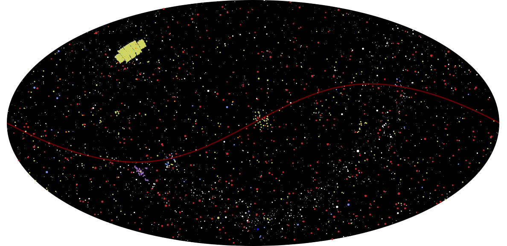

An interactive [exoplanet visualization](https://snoopjedi.github.io/exoplanet_viewer/) using the [Open Exoplanet Catalogue](http://www.openexoplanetcatalogue.com/) dataset and some hacks on top of [VirtualSky](https://github.com/slowe/VirtualSky).

Created in 24 hours by [Leo Alcorn](https://github.com/lyalcorn) and [James Gerity](https://github.com/snoopjedi) for TAMUHack 2016.
